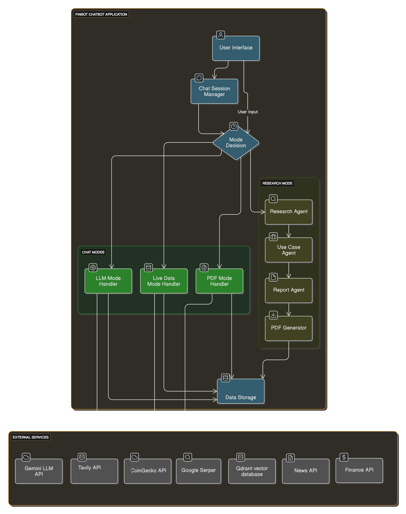
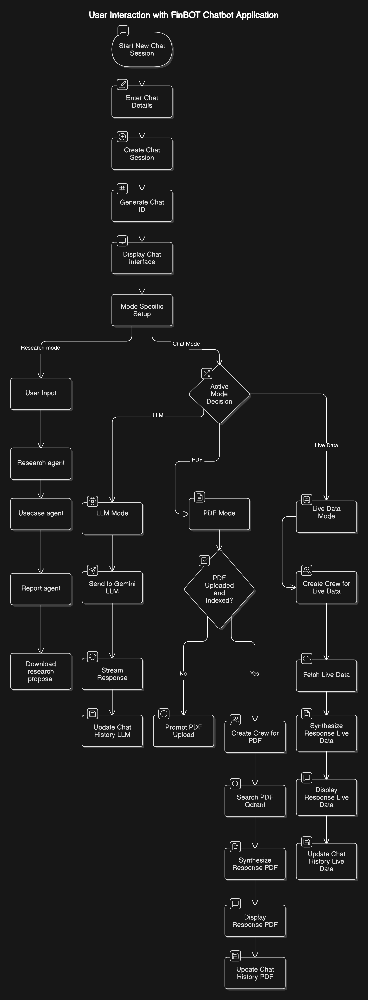
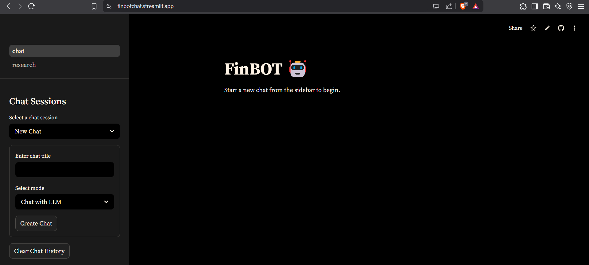
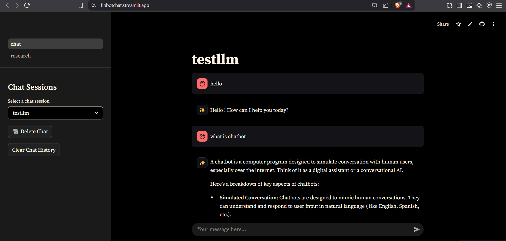
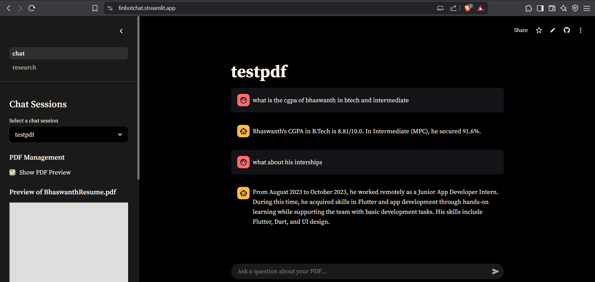
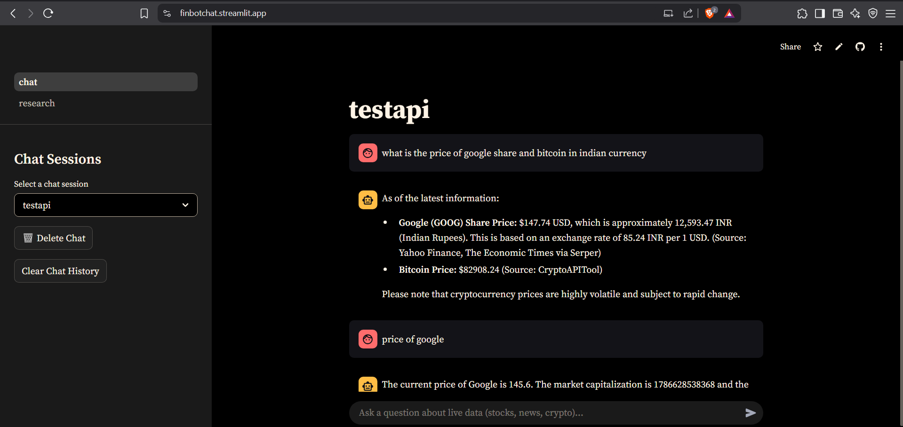
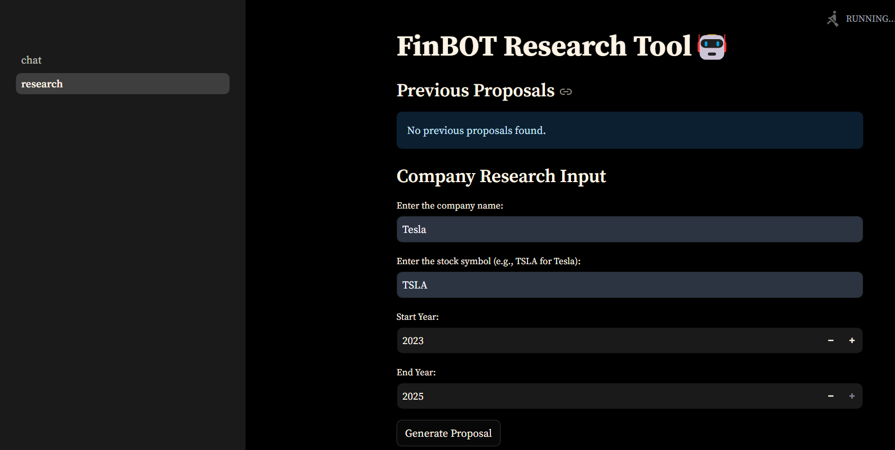
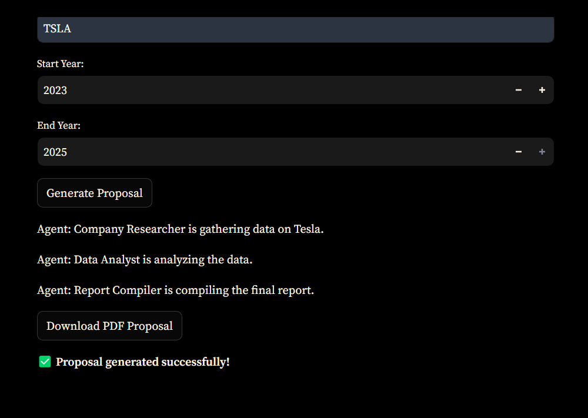

# FinBOT - Agentic RAG Chatbot

FinBOT is an advanced chatbot application built with **Streamlit** and **CrewAI**, leveraging **Retrieval-Augmented Generation (RAG)** techniques. It offers a versatile platform where users can interact with an AI model in multiple modes: chatting directly with a language model, querying content from uploaded PDFs, or fetching live financial data. The application supports multiple chat sessions, PDF indexing for semantic search, and real-time data retrieval from financial APIs, making it a powerful tool for financial analysis and research.

---

## Features

- **Multi-Mode Chat:**
  - **Chat with LLM:** Engage in conversations with the **Gemini AI model** for general queries or assistance.
  - **Chat with PDF:** Upload a PDF and ask questions about its content using semantic search.
  - **Chat with Live Data:** Query real-time financial data, including stock prices, news, and cryptocurrency information.

- **Chat Session Management:** Create, select, and delete multiple chat sessions with persistent history.

- **PDF Indexing and Search:** Upload PDFs and search their content using **Qdrant** for vector storage and **Sentence Transformers** for embeddings.

- **Live Data Integration:**
  - Fetch stock data from **Yahoo Finance**.
  - Retrieve news articles from **NewsAPI**.
  - Get cryptocurrency prices from **CoinGecko**.

- **Research Proposal Generation:** Generate detailed research proposals for companies, including stock performance analysis and news summaries, compiled into downloadable PDFs.

- **Streamlit Interface:** A user-friendly web interface for seamless interaction.

---

## Installation

To set up FinBOT locally, follow these steps:

1. **Clone the Repository:**
   ```bash
   git clone https://github.com/bhaswanth67/finbot-agentic-rag-chatbot.git
   cd finbot-agentic-rag-chatbot
   ```

2. **Create a Virtual Environment:**
   ```bash
   python -m venv venv
   source venv/bin/activate  # On Windows: venv\Scripts\activate
   ```

3. **Install Dependencies:**
   ```bash
   pip install -r requirements.txt
   ```

4. **Set Up Environment Variables:**

   Create a `.env` file in the root directory with the following keys:

   ```
   GEMINI_API_KEY=your_gemini_api_key_for_chat
   GEMINI_API_KEY_TWO=your_gemini_api_key_for_research
   SERPER_API_KEY=your_serper_api_key_for_chat
   SERPER_API_KEY_TWO=your_serper_api_key_for_research
   NEWSAPI_KEY=your_newsapi_key
   QDRANT_URL=your_qdrant_url
   QDRANT_API_KEY=your_qdrant_api_key
   ```

5. **Run the Application:**
   ```bash
   streamlit run chat.py
   ```

---

## Usage

### Chat Interface (`chat.py`)

- **Start a New Chat:**
  - In the sidebar, select "New Chat," enter a title, choose a mode (Chat with LLM, Chat with PDF, or Chat with Live Data), and click "Create Chat."

- **Select Existing Chat:**
  - Choose from the list of previous chats in the sidebar to resume a session.

- **Chat Modes:**
  - **Chat with LLM:**
    - Interact directly with the Gemini AI model for general conversations.
    - Chat history is maintained for context-aware responses.
  - **Chat with PDF:**
    - Upload a PDF in the sidebar. The system indexes it for search.
    - Ask questions about the PDF content, and get responses based on semantic search.
    - View a preview of the uploaded PDF.
  - **Chat with Live Data:**
    - Ask about stocks, news, or cryptocurrencies (e.g., "What's the latest price of Bitcoin?").
    - Receive real-time data from integrated APIs.

- **Manage Chats:**
  - Delete chats or clear chat history using sidebar options.

---

### Research Proposal Generation (`pages/research.py`)

- **Access the Research Tool:**
  - Navigate to the "Research" page via the Streamlit sidebar.

- **Generate a Proposal:**
  - Enter the company name, stock symbol (e.g., TSLA), start year, and end year.
  - Click "Generate Proposal" to create a detailed research report.
  - The report includes stock performance, product launches, market trends, and a conclusion, output as a PDF.

- **Manage Proposals:**
  - View, download, or delete previous proposals from the interface.

---

## Project Structure

```
bhaswanth67-finbot-agentic-rag-chatbot/
├── chat.py                # Main script for the chat interface
├── requirements.txt       # List of project dependencies
├── pages/                 
│   ├── research.py        # Script for generating research proposals
│   └── proposals/         # Directory storing generated PDF proposals
├── RAG/
│   ├── __init__.py        
│   ├── data/              # Chat session and message history
│   │   └── ...            # Session files and chat logs
│   ├── proposals/         
│   └── tools/             # Custom tools for RAG functionality
│       ├── api_tools.py   # Live data retrieval tools
│       ├── llm_chat_tool.py # LLM interaction tool
│       └── pdf_search_tool.py # PDF processing and search
└── .streamlit/
    └── config.toml        # Streamlit theme config
```
### Architecture Diagram


### Flowchart


---


## How It Works

### Chat with LLM

- **Technology:** Uses Gemini AI via `google-generativeai`.
- **Mechanism:** Maintains session history for context. Messages are streamed dynamically.
- **Storage:** History saved in `RAG/data/` as serialized files.

### Chat with PDF

- **Technology:**
  - MarkItDown extracts text.
  - SemanticChunker splits content.
  - SentenceTransformer generates embeddings.
  - Qdrant stores/searches chunks.

- **Mechanism:** Uploaded PDFs are indexed into Qdrant collections. Queries are matched semantically.

- **Output:** Relevant chunks synthesized into coherent answers.

### Chat with Live Data

- **Technology:**
  - CrewAI agents orchestrate tools.
  - YahooFinanceTool, NewsAPITool, CryptoAPITool.

- **Mechanism:** Analyzes queries, fetches data, and formats with source attribution.

- **Output:** Formatted responses with real-time data.

### Research Proposal Generation

- **Technology:** CrewAI agents + tools.
  - YFinanceHistoricalTool (stock data)
  - SerperDevTool (news)
  - FPDF (PDF generation)

- **Mechanism:**
  - Research Agent: Collects info.
  - Analysis Agent: Finds trends.
  - Report Agent: Generates PDF.

- **Output:** PDF reports stored in `pages/proposals/`.

---

### Screenshots







---

## Contributing

1. **Fork the Repository:** Click "Fork" on GitHub.
2. **Create a Branch:**
   ```bash
   git checkout -b feature/your-feature-name
   ```
3. **Commit Changes:**
   ```bash
   git commit -m "Add your descriptive message"
   ```
4. **Push Your Branch:**
   ```bash
   git push origin feature/your-feature-name
   ```
5. **Create a Pull Request:** Submit a PR on GitHub.


## Additional Notes

- **Dependencies:** Listed in `requirements.txt` (e.g., `streamlit`, `crewai`, `qdrant-client`, `sentence-transformers`).
- **Customization:** Edit `.streamlit/config.toml` for theme tweaks.
- **Data Persistence:** Ensure `RAG/data/` is writable.

